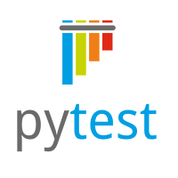
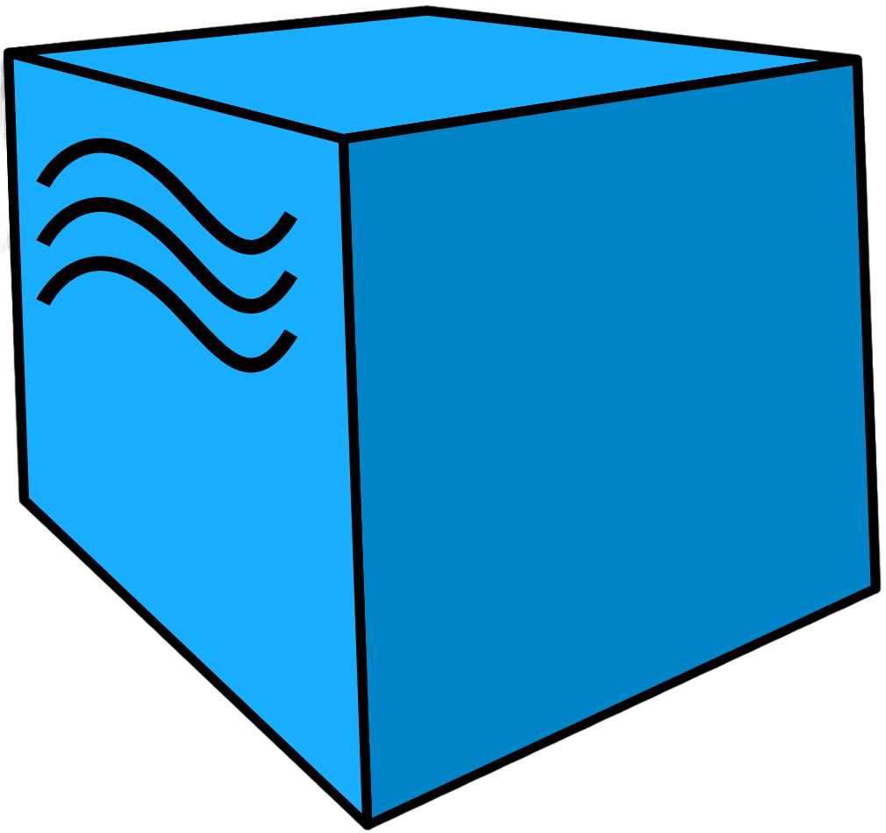
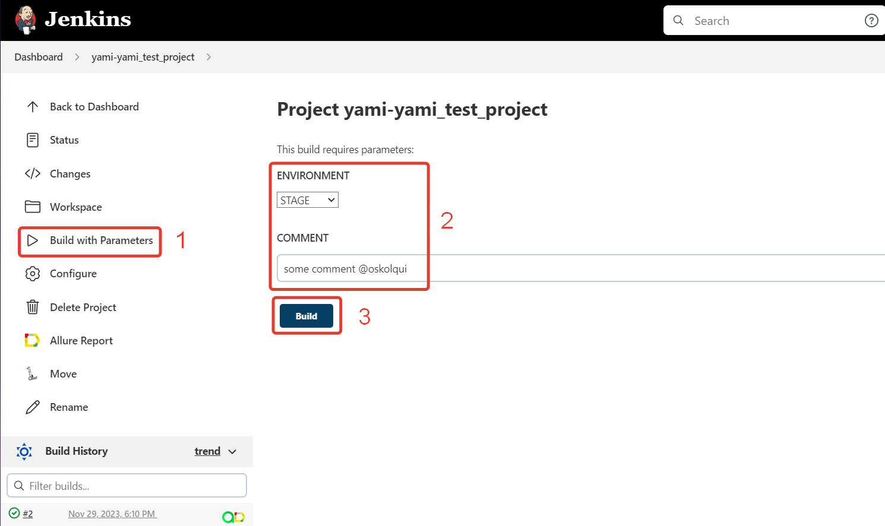
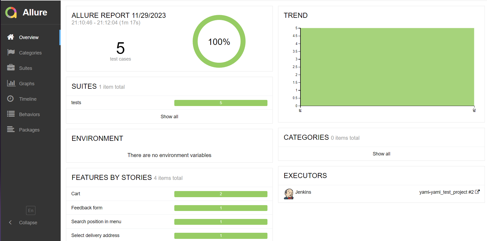
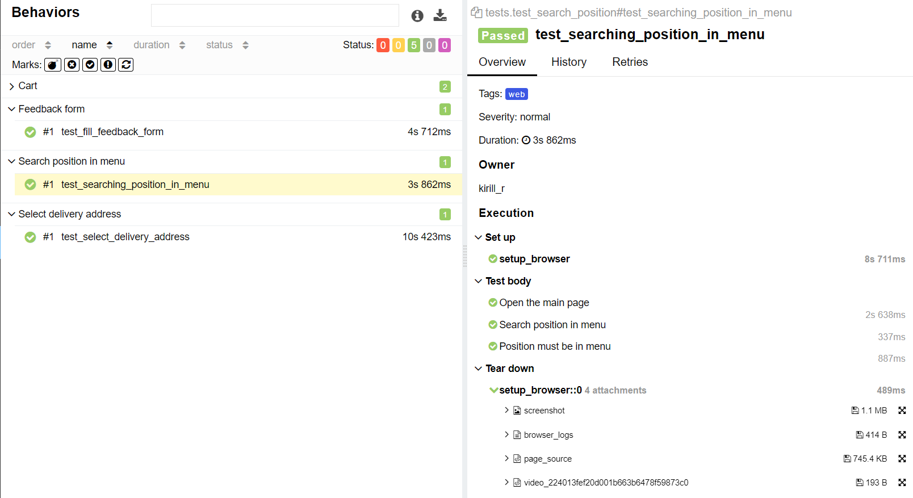
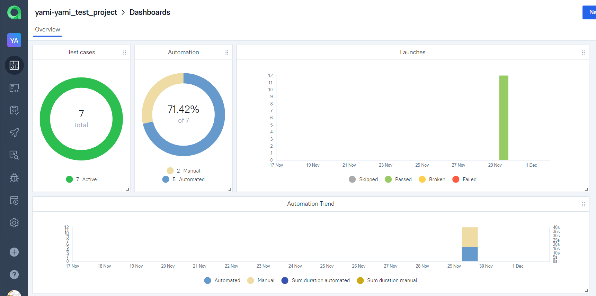
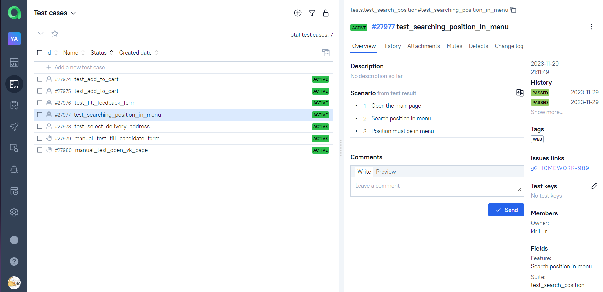
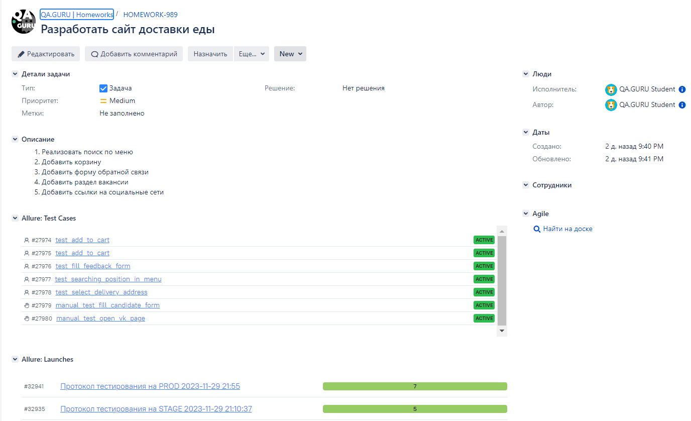
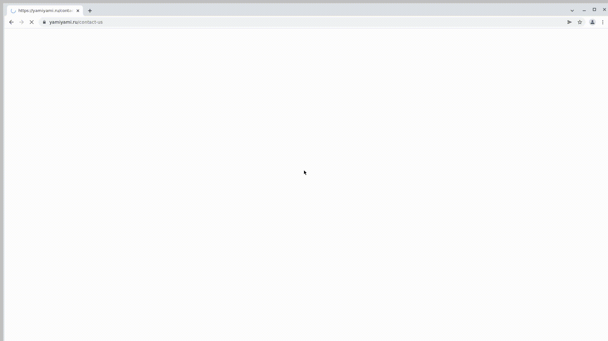
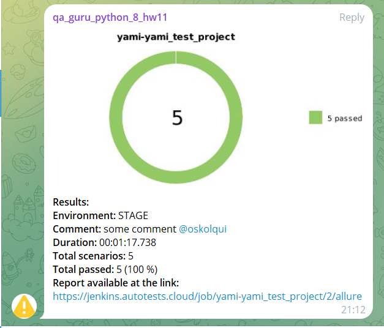

# Проект по автоматизации тестирования сайта доставки еды [YAMI YAMI](https://yamiyami.ru/)

## Технологии и инструменты

 
 
 
 
 

> *В данном проекте написаны UI-автотесты на <code><strong>*Python*</strong></code> с использованием <code><strong>*Selene*</strong></code>.*
>
>*Запуск тестов выполняется из <code><strong>*Jenkins*</strong></code>.*
>
>*<code><strong>*Selenoid*</strong></code> используется для запуска браузера.*
>
>*<code><strong>*Allure Report, Allure TestOps, Jira, Telegram Bot*</strong></code> используются для визуализации результатов тестирования.*

## Реализованы проверки

### Auto

> - [x] *Поиск позиции в меню*
>- [x] *Заполнение адреса доставки*
>- [x] *Добавление позиции из меню в корзину*
>- [x] *Удаление позиции из корзины*
>- [x] *Заполнение формы обратной связи*

### Manual

>- [x] *Заполнение формы кандидата*
>- [x] *Переход на страничку компании в социальных сетях*

## Запуск тестов в [Jenkins](https://jenkins.autotests.cloud/job/yami-yami_test_project/)

### Параметры сборки

* `environment` - параметр определяет окружение для запуска тестов
* `comment` - комментарий

*Для запуска сборки необходимо указать значения параметров и нажать кнопку <code><strong>*Build*</strong></code>.*

  

*После выполнения сборки, в блоке <code><strong>*История сборок*</strong></code> напротив номера сборки появится
значок <code><strong>*Allure
Report*</strong></code>, кликнув по которому, откроется страница с сформированным html-отчетом.*

  

##  Отчет о результатах тестирования в [Allure Report](https://jenkins.autotests.cloud/job/yami-yami_test_project/2/allure/)

### Список тестов c описанием шагов и визуализацией результатов

  

##  Интеграция с [Allure TestOps](https://allure.autotests.cloud/project/3857/dashboards)

### Основной дашборд

  

### Тест-кейсы

  

##  Интеграция с [Jira](https://jira.autotests.cloud/browse/HOMEWORK-989)

  

##  Пример запуска теста в Selenoid

  

##  Уведомления в Telegram

  

